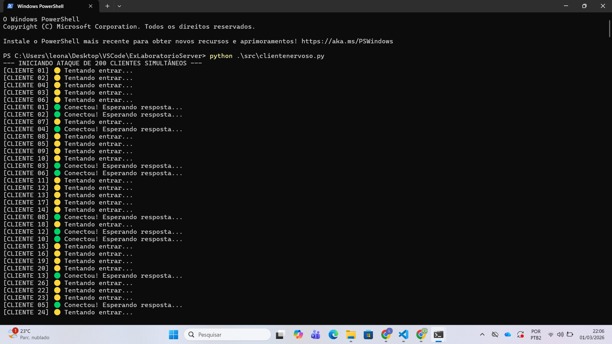

## Ambiente de teste
- SO: (ex: Windows 11 / Ubuntu 22.04 / macOS)
- Python: (ex: 3.11.x)
- Testes executados em: 127.0.0.1 (localhost)

---

## Questão 1 — Backlog e Recusa de Conexões

- No `servergargalo.py` (listen/backlog baixo), ao rodar o `clientenervoso.py` (10 conexões):
  - Erros observados: (marque os que apareceram)
    - [ ] ConnectionRefusedError
    - [ ] Timeout (socket.timeout)
  - Quantos clientes falharam aprox.: ___ / 10

- No `server.py` (multithread), ao rodar o `clientenervoso.py`:
  - Resultado: conexões aceitas praticamente de imediato, sem falhas aparentes.

O parâmetro de backlog passado para `listen()` define o tamanho da fila de conexões pendentes que o **Sistema Operacional** mantém para um socket em modo passivo.  
No `servergargalo.py`, como o backlog é muito pequeno, quando vários clientes tentam conectar ao mesmo tempo, a fila de conexões pendentes se esgota. A partir daí:

- alguns clientes podem receber **ConnectionRefusedError** (o kernel rejeita novas tentativas), ou
- podem ficar aguardando e estourar **Timeout** (tentativa não completa dentro do tempo).

Já no `server.py`, o servidor aceita conexões rapidamente e delega o atendimento para múltiplas threads, reduzindo a chance de a fila ficar cheia, então o `clientenervoso.py` tende a conectar “na hora”.

**Observação importante:** o valor do backlog é tratado pelo kernel como “dica” e o comportamento pode variar entre SOs (por isso alguns ambientes mostram recusa imediata e outros mostram mais timeouts).

---

- Maior valor visto em `threading.active_count()` no `server.py`: ___ threads

No modelo **multithread**, cada conexão tende a virar uma thread. Isso aumenta:
- **memória**: cada thread tem stack e estruturas do SO (cresce com o número de clientes simultâneos).
- **CPU**: com muitas threads, cresce o custo de **troca de contexto (context switch)** e a competição por tempo de CPU, mesmo quando boa parte das threads está “parada” esperando I/O.

No modelo **assíncrono (Event Loop)** (`server_async.py`), o processo pode manter **uma única thread** e lidar com N conexões via corrotinas:
- quando uma corrotina precisa esperar I/O (ou `asyncio.sleep`), ela “cede” o controle ao event loop;
- o event loop aproveita esse tempo para avançar outras conexões, reduzindo o overhead de threads e de context switch.

Na prática, o modelo assíncrono tende a escalar melhor em número de conexões simultâneas, especialmente quando o gargalo é I/O (muitos clientes esperando resposta).

---

## Desafio Extra (200 conexões)

- Alteração realizada em `clientenervoso.py` para 200 conexões: (sim/não)
- Evidência: screenshot abaixo

